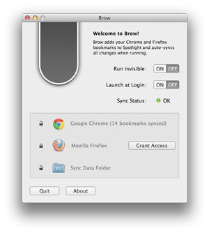

# Brow

Brow adds your Google Chrome and Mozilla Firefox bookmarks to the macOS Spotlight Service. Spotlight will show the bookmarks (including previews), as it already does now with Safari bookmarks, and will open them with your default web browser. Brow runs as a menubar app or, if you choose, invisible in the background. That's all.

## Requirements

Brow requires at least OS X 10.7.4.

## Features

* Brow reads out your local Chrome and Firefox bookmarks and stores them in a file format Spotlight understands. After Brow has added your Chrome and Firefox bookmarks to Spotlight, it doesn't need to run for your bookmarks still being accessible with Spotlight.
* When running, Brow monitors your Chrome and Firefox bookmarks and will sync any changes to Spotlight within seconds.
* Bookmarks brought to Spotlight by Brow will be shown in the Documents section of the Spotlight window, whereas Spotlight will show Safari bookmarks in a distinctive Webpages section.
* Brow runs in a sandbox and therefore needs your explicit permission to access your Chrome and Firefox bookmark folders as well as the sync data output folder. Brow will ask for such permission at first launch.

## Screenshot

